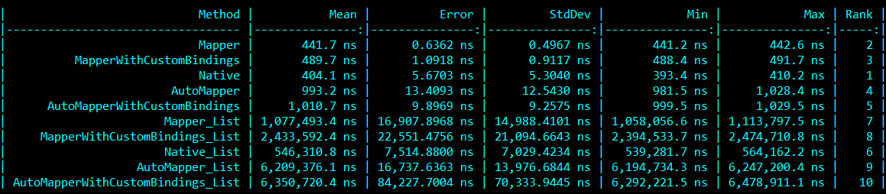

# ExprMapper

Simple C# POCO classes mapper, based on the [Expressions](https://docs.microsoft.com/en-gb/dotnet/api/system.linq.expressions.expression-1?view=netcore-3.0) generation, avialable as the .NET Standard 2.0 library.

## How it works?

Based on the class structure, it generates binding expression, which is compiled into the function. It tracks class properties and generates the following code:

```csharp
return new Destination {
	PropInt = source.PropInt,
	PropStr = source.PropStr,
	PropRef = source.PropRef != null ? PropRef : null,
	// ...
}
```

## Features

- Objects mapping with null references handling
- Nested objects mapping
- Mapping collection types (array, list & IEnumerable), as well as collection type properties
- Custom mapping functions for selected properties

## How to use it?

First, creates the mapper instance, which defines available mappings:

```csharp
var mapper = new Mapper()
    .Add<L, R>()
	.Add<UserDTO, User>();
```

Then just call:

```csharp
var result = mapper.Map<L, R>(someObj);
```

Defining the mapping with custom bindings:

```csharp
var mapper = new Mapper().Add<L, R>(
	(r => r.Id, l => l.Id.ToString())
	(r => r.Year, l => (short)l.Date.Year)
);
```

To see more scenarios, check the `ExprMapper.Test` project.

## Requirements

- parameterless constructor in a target class
- only public properties are mapped
- inner collections' types have to be the same in source & destination classes (`T[] -> U[]`, `IList<T> -> IList<U>`, `IEnumerable<T> -> IEnumerable<U>`)

## Motivation

Expressions allows us to generate code in a runtime, which can be really fast (at least faster than reflection). This library is small and efficient. It can easily improve a development process.

## Benchmark

Benchmark results. Check the `ExprMapper.Bench` project for details.


